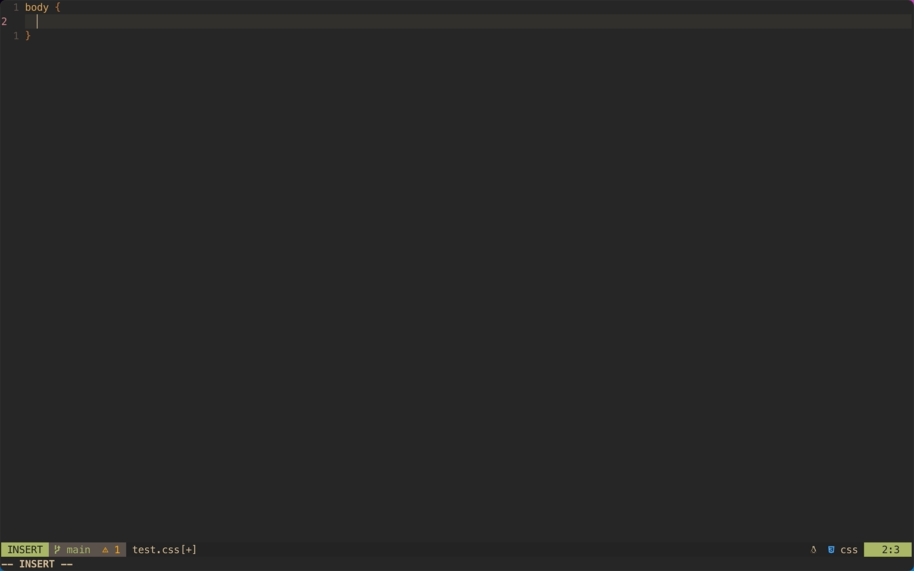

# cmp-tw2css

- [한국어 문서 읽으러 가기](README-KO.md)

A source for [`nvim-cmp`](https://github.com/hrsh7th/nvim-cmp) to convert [tailwindcss](https://tailwindcss.com) classes to pure css codes.
It uses treesitter to find out whether any css code block exists in the code and loads the completion source.

## Setup

### Prerequisites:

`cmp-tw2css` uses `nvim-cmp` to provide the code. You first need to have `nvim-cmp` installed in your neovim. To install `nvim-cmp`, please visit the [nvim-cmp Github repo](https://github.com/hrsh7th/nvim-cmp).

Since version 1.0.0, `cmp-tw2css` uses css parser to detect if the cursor is inside the css code block. To fully use this feature, you need to install the css parser through `nvim-treesitter`. For more information, please refer to [nvim-treesitter](https://github.com/nvim-treesitter/nvim-treesitter).

### Installation

To install `cmp-tw2css`, I recommend using [`packer.nvim`](https://github.com/wbthomason/packer.nvim).

```lua
use({
  "hrsh7th/nvim-cmp",
  requires = {
    "jcha0713/cmp-tw2css",
  },
})
```

And to add source, go to `nvim-cmp` configuration and add the following

```lua
require('cmp').setup {
  -- ...
  sources = {
    { name = 'cmp-tw2css' },
    -- other sources ...
  },
  -- ...
}
```

## Usage

Using `cmp-tw2css` is simple. Open any file that contains css code blocks and start typing tailwindcss classes that you want to convert into css codes.

### Example



- `*.css`:

```css
body {
  /* flex -> display: flex; */
  /* p-6 -> padding: 1.5rem; */
  /* ... */
}
```

- `*.html`:

```html
<!DOCTYPE html>
<html lang="en">
  <head>
    <style>
      body {
        /* m-2 -> margin: 0.5rem; */
      }
    </style>
  </head>
  <body>
    <!-- body -->
  </body>
</html>
```

## Configuration

```lua
require('cmp-tw2css').setup({ ... })
```

### `fallback`

**type**: `boolean`
**default**: `true`

```lua
{
  fallback = true
}
```

Determines whether to load the completion items when there is no treesitter parser. If this is set to `true`, you are allowing `cmp-tw2css` to load the completion items regardless of your cursor position. If it is set to `false`, then it simply does not load anything when there is no css parser.

## Limitation

There are a number of limitations to `cmp-tw2css`. First, the source of this plugin is a result of web scraping. This means that you might find some items are missing while using. If this happens to you, please let me know by submitting an issue so that I can update the source accordingly. Another downside is that it can't be dynamically generated and only provides the code from the official website.

Currently `cmp-tw2css` does not automatically add tabs for the additional lines when the insert text is more than one line. And also when there are more than one colon(`:`) in a line, `cmp-tw2css` cannot properly load its completion source.

## Roadmap

- [x] Load the source only when the cursor is inside the code block
- [x] Provide ways to configure with treesitter
- [ ] Show documentation when selecting an item...?
- [ ] Provide the completion source using LSP functionality

## Credit

- [`cmp-emoji`](https://github.com/hrsh7th/cmp-emoji)
- [`cmp-npm`](https://github.com/David-Kunz/cmp-npm)
- [`nvim-treesitter`](https://github.com/nvim-treesitter/nvim-treesitter)
